import Tabs from '@theme/Tabs';
import TabItem from '@theme/TabItem';
import Link from '@docusaurus/Link';
import YouTubeEmbed from '@site/src/components/YouTubeEmbed';

# Embodied Space Studio [UE Plugin]

Embodied Space Studio is an Unreal Editor workflow panel for authoring embodied motion from text, spatial constraints, saved motion data, and batch prompt collections. It connects the editor to the Kimodo bridge/runtime service, lets you stage prompt timing and body constraints in the Timeline, previews generated motion on either the embedded Preview viewport or the main Level viewport, and turns the selected motion into UE Animation Sequence assets for SOMA, Manny, Quinn, MetaHuman, or a custom retarget target.

The motions were generated using Kimodo, a controllable human motion generation system described in:
Davis Rempe et al., "Kimodo: Scaling Controllable Human Motion Generation," arXiv:2603.15546, 2026. https://arxiv.org/abs/2603.15546

:::info Main workflow

1. Use **Generate** to start or check the bridge service, refresh the model catalog, choose dataset/skeleton/version, load a model, choose the source preview mesh or default SOMA, and generate motion from Timeline prompts and constraints.
2. Use **Preview Target** for fast isolated inspection, or **Level Target** to work directly in the main Level viewport with **Spawn SOMA**, **Use Selected**, **Focus**, and **Unlink**.
3. Use the **Timeline** to create prompt sections, scrub frames, play generated samples, import bulk prompt text, and place Full-Body, 2D Root, hand, and foot constraints.
4. Use **Constraints** when a motion needs exact body poses, hand/foot placement, root path control, saved skeleton edit states, or external `constraints.json` input.
5. Use **Load/Save** to reopen saved `ue_preview_manifest.json` outputs, save reusable example metadata, and open generated output folders.
6. Use **Visualize** to control playback speed, mesh/skeleton/foot-contact overlays, floor/environment display, camera FOV, Timeline visibility, and constraint label display.
7. Use **Export** to bake the active motion as a SOMA Animation Sequence, build or refresh rooted SOMA retarget assets, select target character assets, tune collision/foot anchoring options, and export a target Animation Sequence.
8. Use **Batch** to process many prompts or already-generated SOMA jobs, export multiple target families, preview generated naming, and resume or stop a batch run.
9. Use **Misc** for production utilities: placing batch animations into a level, creating a MetaHuman player character, merging MetaHuman body/garment meshes, packaging a Fab product, offline collision/grounding cleanup, MetaHuman Level Sequences, and prompt subtitles.

When a button is disabled, check the status summaries above the active section. Most actions require a healthy bridge service, a loaded model, a valid preview clip, a matching source/target mesh, a selected Level Target, or a valid `/Game` output path. Runtime Output and Bridge Output logs are designed for troubleshooting and can be copied from the UI.

:::

<YouTubeEmbed id="Ava3wQtkbrY" />

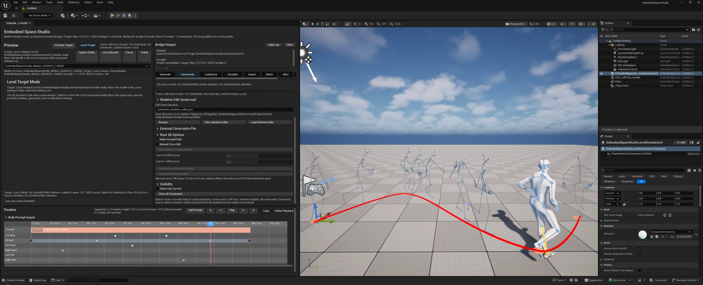

## Kimodo Docker Runtime Setup

Embodied Space Studio uses a local Docker Compose runtime to serve Kimodo motion generation to Unreal Engine. The Unreal Engine plugin is distributed through **Fab**, while the Docker bridge runtime is distributed separately through GitHub:

```text
https://github.com/richieBao/embodied-space-studio-kimodo-bridge
```

In this bridge repository, `kimodo-main` is the Docker Compose project name declared in `docker-compose.yaml`. The always-on services are `text-encoder` and `ue-bridge`; `demo` is optional for the standalone Kimodo web demo.

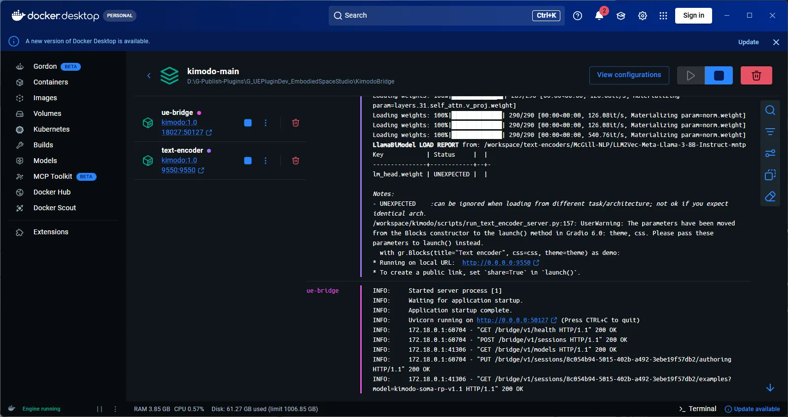

### Install order

1. Buy/download and install the **Embodied Space Studio** plugin from Fab into your Unreal project.
2. Install and start Docker Desktop.
3. Clone or download the GitHub bridge repository.
4. Request Hugging Face access to `meta-llama/Meta-Llama-3-8B-Instruct`, then authenticate with a Hugging Face token.
5. Download the required Kimodo checkpoint and text encoder model files from their official model pages.
6. Copy `.env.example` to `.env`, then edit paths for your machine.
7. Start the Docker bridge and connect to it from the plugin's **Generate** tab.

### Prerequisite: install Docker Desktop

Docker is required before you can start the Kimodo runtime. Embodied Space Studio does not install Docker automatically.

1. Install **Docker Desktop** for Windows from the official Docker website.
2. Start Docker Desktop and wait until the Docker Engine is running.
3. On Windows, use the WSL2 backend. For GPU generation, also install a compatible NVIDIA driver and make sure Docker Desktop can access the GPU.
4. Open PowerShell and confirm Docker is available:

```powershell
docker --version
docker compose version
```

:::note
Docker is required for **Generate**, **Refresh Models**, **Connect Docker Bridge**, and other Kimodo runtime features. Loading already generated previews or using some offline Unreal-only utilities may not require the Docker runtime to be running.
:::

### Python environment note

The official Kimodo local virtual-environment setup uses Python 3.10:

```powershell
conda create -n kimodo python=3.10
conda activate kimodo
```

Embodied Space Studio normally runs Kimodo through Docker, so users do not need to create this local Python environment unless they want to run Kimodo scripts outside the containers.

### Clone the bridge repository

Choose any local folder for the bridge. The commands below use `<BridgeRoot>` as the folder where you cloned or extracted the GitHub repository.

```powershell
git clone https://github.com/richieBao/embodied-space-studio-kimodo-bridge.git
cd embodied-space-studio-kimodo-bridge
```

The bridge folder should contain:

```text
<BridgeRoot>/docker-compose.yaml
<BridgeRoot>/Dockerfile
<BridgeRoot>/scripts
<BridgeRoot>/checkpoints
<BridgeRoot>/text-encoders
```

Separately, your Unreal project must already contain the Fab plugin:

```text
<YourUnrealProject>/Plugins/KimodoMotionAuthoring/Resources/Python/kimodo_ue_service/server.py
```

The Docker `ue-bridge` service mounts your Unreal project read-only and runs that Fab-installed `server.py` inside the container.

### Runtime layout

| Service | Container name | Purpose | Host access |
|:--|:--|:--|:--|
| `text-encoder` | `text-encoder` | Loads the LLM2Vec text encoder and provides embeddings to Kimodo services. | `http://127.0.0.1:9550` |
| `ue-bridge` | `ue-bridge` | Runs the Unreal bridge API used by the plugin Generate / Models / Health actions. | `http://127.0.0.1:18027/bridge/v1` |
| `demo` | `demo` | Optional Kimodo interactive demo service. | `http://127.0.0.1:7860` by default |

The services are built from `Dockerfile` into the `kimodo:1.0` image. The image is based on NVIDIA PyTorch, installs the Kimodo Python runtime, and runs through the container entrypoint that maps files back to the host user.

### Download model files

Model weights are intentionally not included in the GitHub repository. Download them from the official model pages and review their licenses before use.

Download the Kimodo checkpoint:

```text
https://huggingface.co/nvidia/Kimodo-SOMA-RP-v1.1
```

Place it under:

```text
<BridgeRoot>/checkpoints/Kimodo-SOMA-RP-v1.1/model.safetensors
<BridgeRoot>/checkpoints/Kimodo-SOMA-RP-v1.1/config.yaml
```

Before downloading the text encoder, open the gated Meta Llama model page, request access, and wait until your Hugging Face account has been granted access:

```text
https://huggingface.co/meta-llama/Meta-Llama-3-8B-Instruct
```

Then authenticate on the host machine:

```powershell
pip install --upgrade huggingface_hub
hf auth login
```

Kimodo's LLM2Vec text encoder uses three pieces:

```text
Raw gated base model:
https://huggingface.co/meta-llama/Meta-Llama-3-8B-Instruct

MNTP LoRA adapter:
https://huggingface.co/McGill-NLP/LLM2Vec-Meta-Llama-3-8B-Instruct-mntp

Supervised LoRA adapter:
https://huggingface.co/McGill-NLP/LLM2Vec-Meta-Llama-3-8B-Instruct-mntp-supervised
```

Place them under:

```text
<BridgeRoot>/text-encoders/McGill-NLP/LLM2Vec-Meta-Llama-3-8B-Instruct-mntp/
<BridgeRoot>/text-encoders/McGill-NLP/LLM2Vec-Meta-Llama-3-8B-Instruct-mntp-adapter/
<BridgeRoot>/text-encoders/McGill-NLP/LLM2Vec-Meta-Llama-3-8B-Instruct-mntp-supervised/
```

Example manual download commands:

```powershell
hf download meta-llama/Meta-Llama-3-8B-Instruct --local-dir text-encoders/McGill-NLP/LLM2Vec-Meta-Llama-3-8B-Instruct-mntp
hf download McGill-NLP/LLM2Vec-Meta-Llama-3-8B-Instruct-mntp --local-dir text-encoders/McGill-NLP/LLM2Vec-Meta-Llama-3-8B-Instruct-mntp-adapter
hf download McGill-NLP/LLM2Vec-Meta-Llama-3-8B-Instruct-mntp-supervised --local-dir text-encoders/McGill-NLP/LLM2Vec-Meta-Llama-3-8B-Instruct-mntp-supervised
```

The `LLM2Vec-Meta-Llama-3-8B-Instruct-mntp` local folder should include the gated raw Meta Llama files such as `model.safetensors.index.json` and shard files. The `...-mntp-adapter` and `...-mntp-supervised` folders are LoRA adapters and should include `adapter_model.safetensors` and `adapter_config.json`.

The `McGill-NLP/LLM2Vec-Meta-Llama-3-8B-Instruct-mntp` page may look small in the Hugging Face file browser because it is the MNTP adapter, not the full 8B base model. The full 8B shard files come from the gated `meta-llama/Meta-Llama-3-8B-Instruct` repository.

Do not download a separate `McGill-NLP/LLM2Vec-Meta-Llama-3-8B-Instruct-mntp-adapter` repository. The recommended local folder is named `LLM2Vec-Meta-Llama-3-8B-Instruct-mntp-adapter` only to make its runtime role clear. Its source is `McGill-NLP/LLM2Vec-Meta-Llama-3-8B-Instruct-mntp`.

Runtime loading order:

1. Load raw `meta-llama/Meta-Llama-3-8B-Instruct` files from the local `LLM2Vec-Meta-Llama-3-8B-Instruct-mntp` folder as the base model.
2. Merge the MNTP adapter from `TEXT_ENCODER_MNTP_ADAPTER_HOST`; by default this is the local `LLM2Vec-Meta-Llama-3-8B-Instruct-mntp-adapter` folder downloaded from `McGill-NLP/LLM2Vec-Meta-Llama-3-8B-Instruct-mntp`.
3. Apply `McGill-NLP/LLM2Vec-Meta-Llama-3-8B-Instruct-mntp-supervised` as the final supervised adapter exposed by the `text-encoder` service.

### Configure `.env`

From `<BridgeRoot>`, copy the example file:

```powershell
Copy-Item .env.example .env
```

Then edit `.env` for your machine. Use forward slashes in Windows paths for Docker volume mapping.

```text
ESS_UNREAL_PROJECT_ROOT=C:/Users/YourName/Documents/Unreal Projects/YourProject
HF_HOME_HOST=C:/Users/YourName/.cache/huggingface
HOST_USER=<your-windows-user-name>
SERVER_PORT=7860
TEXT_ENCODER_BASE_MODEL_HOST=./text-encoders/McGill-NLP/LLM2Vec-Meta-Llama-3-8B-Instruct-mntp
TEXT_ENCODER_MNTP_ADAPTER_HOST=./text-encoders/McGill-NLP/LLM2Vec-Meta-Llama-3-8B-Instruct-mntp-adapter
TEXT_ENCODER_ADAPTER_HOST=./text-encoders/McGill-NLP/LLM2Vec-Meta-Llama-3-8B-Instruct-mntp-supervised
TEXT_ENCODER_DEVICE=auto
UE_BRIDGE_HOST_PORT=18027
```

`HF_HOME_HOST` should point to the Hugging Face cache that contains the token created by `hf auth login`. If you prefer to keep the cache inside the bridge folder, place the token under `<BridgeRoot>/.cache/huggingface/token` and use `HF_HOME_HOST=./.cache/huggingface`.

`ESS_UNREAL_PROJECT_ROOT` must point to the Unreal project that has the Fab plugin installed. The bridge expects this file to exist:

```text
<YourUnrealProject>/Plugins/KimodoMotionAuthoring/Resources/Python/kimodo_ue_service/server.py
```

`TEXT_ENCODER_DEVICE` is a Docker startup-level setting for the `text-encoder` service:

```text
TEXT_ENCODER_DEVICE=auto
```

```text
TEXT_ENCODER_DEVICE=cuda
```

```text
TEXT_ENCODER_DEVICE=cpu
```

Use `auto` for CUDA when available with CPU fallback, `cuda` to force GPU, or `cpu` to force CPU text encoding. Use `cuda`, not `gpu`; Kimodo passes this value to PyTorch device selection.

### Start the Unreal bridge runtime

From PowerShell:

```powershell
cd "<BridgeRoot>"
.\scripts\Start-EmbodiedSpaceStudio-Bridge.ps1
```

This starts `text-encoder` and `ue-bridge` in detached mode. The `ue-bridge` service waits for the `text-encoder` healthcheck before becoming available to Unreal Engine.

To rebuild the Docker image before starting:

```powershell
.\scripts\Start-EmbodiedSpaceStudio-Bridge.ps1 -Build
```

To also start the optional Kimodo demo service:

```powershell
.\scripts\Start-EmbodiedSpaceStudio-Bridge.ps1 -WithDemo
```

Equivalent Docker Compose command:

```powershell
docker compose up -d text-encoder ue-bridge
```

### Apply `.env` changes and recreate containers

Docker reads environment variables when a container is created. If you edit `.env`, especially `TEXT_ENCODER_DEVICE`, simply clicking Stop/Start or Restart in Docker Desktop keeps the old container configuration and the old value.

After changing `.env`, run:

```powershell
cd "<BridgeRoot>"
docker compose up -d --force-recreate --no-build text-encoder ue-bridge
```

Use `--build` only when the Docker image itself needs to be rebuilt, such as after changing `Dockerfile`, `docker_requirements.txt`, or dependency files:

```powershell
cd "<BridgeRoot>"
docker compose up -d --build --force-recreate text-encoder ue-bridge
```

Verify the active device setting inside the recreated container:

```powershell
docker exec text-encoder python -c "import os; print(os.environ.get('TEXT_ENCODER_DEVICE'))"
```

### Verify the runtime

Run the packaged verification script:

```powershell
cd "<BridgeRoot>"
.\scripts\Verify-EmbodiedSpaceStudio-Bridge.ps1
```

A healthy bridge should respond at:

```text
http://127.0.0.1:18027/bridge/v1/health
http://127.0.0.1:18027/bridge/v1/models
```

The expected model key for this packaged setup is:

```text
kimodo-soma-rp-v1.1
```

You can also inspect the containers directly:

```powershell
docker ps --filter "name=text-encoder"
docker ps --filter "name=ue-bridge"
cd "<BridgeRoot>"
docker compose logs -f ue-bridge
```

### Stop or reset the runtime

To stop the services while keeping containers available for a faster restart:

```powershell
cd "<BridgeRoot>"
.\scripts\Stop-EmbodiedSpaceStudio-Bridge.ps1
```

To remove the compose containers completely:

```powershell
.\scripts\Stop-EmbodiedSpaceStudio-Bridge.ps1 -RemoveContainers
```

:::tip
If Unreal Engine cannot connect from the Generate tab, first check `http://127.0.0.1:18027/bridge/v1/health`, then confirm that Docker Desktop is running and that `text-encoder` and `ue-bridge` are active. The Unreal plugin's **Connect Docker Bridge** button is intended to drive the same local bridge runtime expected by these scripts.
:::
## User Manual

<Tabs groupId="embodied-space-studio-manual">
  <TabItem value="generate" label="Generate" default>

### Purpose

Connect Unreal Editor to the Kimodo runtime, choose the active generation model and source character, configure sampling/postprocess settings, and submit the current Timeline prompts plus native or external constraints for motion generation.

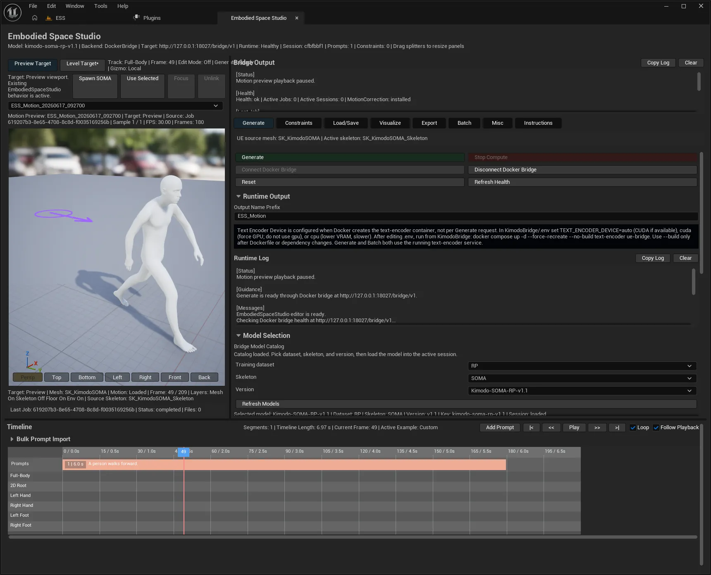

### Action Buttons

1. **Generate / Generating** submits the current request. The button is enabled only when the bridge is healthy, a model is loaded, there is valid prompt content, and the service is not busy.
2. **Stop Compute** asks the bridge/runtime to stop the active compute job without resetting all editor state.
3. **Connect Docker Bridge** and **Disconnect** start or stop the local bridge service. **Refresh Health** rechecks service health, and **Reset** clears editor authoring state and preview state.

### Runtime Output

1. **Output Name Prefix** is used when naming generated job outputs and follow-up assets.
2. **Text Encoder Device** is configured in Docker, not per Generate request. Edit `TEXT_ENCODER_DEVICE` in `KimodoBridge/.env`, then recreate `text-encoder` and `ue-bridge` with `docker compose up -d --force-recreate --no-build text-encoder ue-bridge`.
3. **Runtime Log** records user-facing Generate/Export/Batch actions. **Copy Log** sends it to the clipboard; **Clear** removes the local display text.

### Model Selection

1. **Refresh Models** queries the bridge model catalog.
2. **Training dataset**, **Skeleton**, and **Version** filter the model list. **Load model** makes that model active in the current bridge session.
3. The selected model summary explains whether the model is loaded, unavailable, or waiting on service health.

### Kimodo Mesh / Skeleton

1. **Kimodo Source Preview Mesh** overrides the source mesh used for preview binding and request metadata.
2. **Source Skeleton Override** can provide a skeleton when a mesh is not enough or when a specific binding is required.
3. **Reset To SOMA Default** clears custom source selections and returns to the default Kimodo/SOMA source character.

### Generate Settings

1. **Num Samples** controls how many candidates the runtime returns for the same authored prompt/constraint request.
2. **Seed** becomes active when edited and is used for reproducible generation.
3. **Denoising Steps** controls diffusion refinement cost and quality.
4. **Reduce Foot Sliding** enables runtime foot-contact stabilization. Level 1 is lighter; Level 2 adds stable curves and XY foot lock.
5. **Classifier-Free Guidance** balances **Text Weight** and **Constraint Weight** when CFG is enabled.
6. **Transition Frames** controls blending between adjacent prompt segments.
7. **Post Processing** toggles runtime postprocess, and **Root Margin** adjusts the root-trajectory margin used by that postprocess.

### Recommended Workflow

First author prompts in the Timeline, then add constraints if needed, confirm the bridge health and loaded model, generate one sample set, and inspect it in Preview or Level Target before exporting or batching.

  </TabItem>
  <TabItem value="preview-level-target-timeline" label="Preview / Level Target / Timeline">

### Purpose

The main panel outside the sidebar is where generated motion is viewed, scrubbed, and edited against prompts and constraints. It is also where users choose whether edits happen inside the embedded Preview viewport or directly in the main Unreal Level viewport.

### Preview Header

1. **Preview Target** uses the embedded preview viewport. It is the quickest place to inspect a generated sample without spawning level actors.
2. **Level Target** switches authoring to the main Level viewport. The preview area shows Level Target Mode text while the actual mesh and constraint handle live in the Level viewport.
3. **Spawn SOMA** creates a new EmbodiedSpaceStudio SOMA Level Target in the current level, binds it, loads the active preview mesh/clip, moves the viewport camera to it, and activates Level Target mode.
4. **Use Selected** binds the selected EmbodiedSpaceStudio SOMA Level Target, or a selected Actor with a SkeletalMeshComponent, as the Level Target.
5. **Focus** moves editor viewport cameras to the bound Level Target. **Unlink** detaches the panel from the current Level Target and returns to an unbound Level Target state.
6. The constraint editing state text shows whether editing mode is active and which target is receiving constraint edits.

### Embedded Preview Viewport

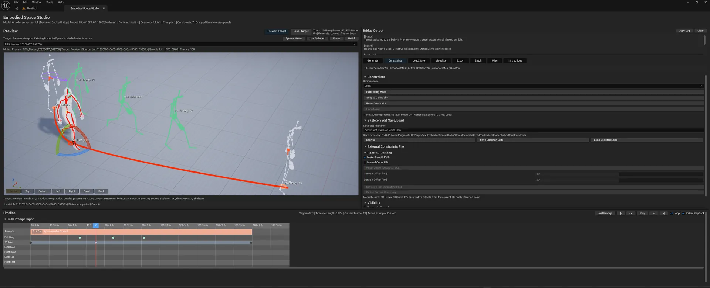

1. **Persp**, **Top**, **Bottom**, **Left**, **Right**, **Front**, and **Back** switch the embedded viewport camera view.
2. The motion sample selector chooses among generated samples from the loaded preview manifest.
3. Motion Preview summary reports clip name, active target, source, sample count, FPS, and frame count.
4. Last Job / status text reports the latest bridge job and generated output state.

### Level Target Editing

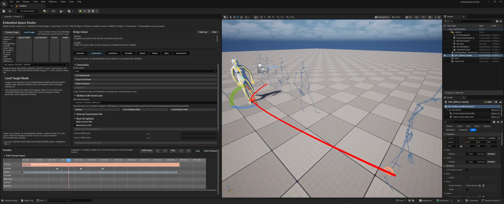

1. In Level Target mode, select and move the Level constraint handle in the main Level viewport while prompt, timeline, generation, and visualization controls remain in this panel.
2. The Level Target receives the same preview mesh, active sample, playback frame, root path preview, and constraint markers as the embedded preview.
3. Holding **Shift** while using the Level Target edit widget switches to rotation behavior, mirroring the Preview Target constraint editing behavior.

### Timeline Top Bar

1. **Add Prompt** adds a new prompt segment.
2. `|<` and `>|` jump to first/last frame; `<<` and `>>` step backward/forward; **Play/Pause** controls motion playback.
3. **Loop** repeats playback. **Follow Playback** keeps the Timeline scrolled near the current playback frame.
4. **Bulk Prompt Import** accepts numbered prompt text such as `1[8]. text`. **Replace Timeline Prompts** converts it into timed prompt segments; **Clear Timeline Prompts** removes all prompt segments; **Clear Bulk Prompt Text** clears only the import box.

### Timeline Mouse / Keyboard Operations

1. Click or drag on the ruler to scrub Current Frame. **Shift + mouse wheel** zooms Timeline pixels-per-frame.
2. In the prompt row, left-click creates or selects a prompt; drag inside a prompt moves it; drag an edge resizes it; right-click deletes it; double-click edits text. **Enter** commits inline text edits and **Escape** cancels them.
3. Prompt moves and resizes snap to neighboring prompt boundaries, while respecting minimum and maximum prompt duration.
4. Constraint rows are **Full-Body**, **2D Root**, **Left Hand**, **Right Hand**, **Left Foot**, and **Right Foot**. Left-click creates/selects a key; drag moves a range; drag edges resize a range; Ctrl/Command/Shift-drag creates an interval; right-click deletes where supported.
5. Constraint ranges carry edited joint transforms with them when moved, and remove out-of-range per-frame edits when resized.

### Recommended Workflow

Author prompt timing first, generate or load a preview, use playback to find important frames, then switch on constraint editing and add precise constraint keys or ranges where the motion needs correction.

  </TabItem>
  <TabItem value="constraints" label="Constraints">

### Purpose

Create, edit, save, load, and filter native Timeline constraints and optional external `constraints.json` input so the generated motion respects authored body poses, hand/foot placement, and 2D root path intent.

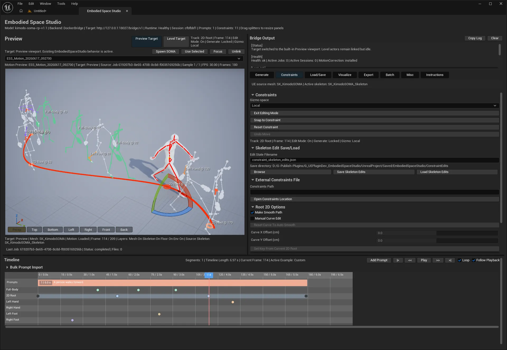

### Constraints Section

1. **Gizmo space** selects how the live edit handle interprets movement while constraint editing is active.
2. **Enter Editing Mode / Exit Editing Mode** toggles live rig editing. While editing is active, Generate is intentionally blocked and the Preview or Level Target exposes constraint handles.
3. **Snap to Constraint** moves the current frame preview/edit target onto the active constraint on the selected track.
4. **Reset Constraint** clears the active edited transform for the selected/current constraint. **Undo Move** is currently reserved and disabled in the UI.
5. The state summary reports active target, selected track, editing status, and current frame context.

### Skeleton Edit Save/Load

1. **Edit State Filename** names a saved skeleton edit state under the default constraints edit directory.
2. **Browse** selects an edit-state filename. **Save Skeleton Edits** writes current native constraints and edited joint transforms. **Load Skeleton Edits** restores them.

### External Constraints File

1. **Constraints Path** can point at an external `constraints.json` file.
2. **Open Constraints Location** opens the folder for the current constraints path.
3. Native Timeline constraints are preferred when authored; an external path is useful for legacy files, imported examples, or generation requests that should use a prebuilt `constraints.json`.

### Root 2D Options

1. **Make Smooth Path** densifies/smooths the 2D Root path from authored 2D Root constraints.
2. **Manual Curve Edit** enables `FRichCurve` X/Y offsets relative to the current 2D Root reference path.
3. **Reset Curve To Auto Smooth** discards manual offsets and rebuilds from the automatic smoothed path.
4. **Curve X Offset** and **Curve Y Offset** edit the current frame's manual offset when a valid manual curve exists.
5. **Set Key From Current 2D Root** writes a manual curve key from the current preview/root position. **Delete Current Curve Key** removes the current frame's manual root key.
6. The manual curve status line reports whether manual edit is active, whether enough 2D Root points exist for Generate, and how many keys are stored.

### Visibility

1. **Show only Current** filters constraint markers to the current frame.
2. **Clear All Constraints** removes all native Timeline constraints.

### Recommended Workflow

Load or generate a preview, scrub to the frame, enable editing, choose Full-Body/2D Root/hand/foot track in the Timeline, create or select a constraint key, move the handle, save edits if they should be reused, then exit editing before generating.

  </TabItem>
  <TabItem value="load-save" label="Load/Save">

### Purpose

Reopen generated motion previews, save reusable example metadata, and inspect generated output folders without running generation again.

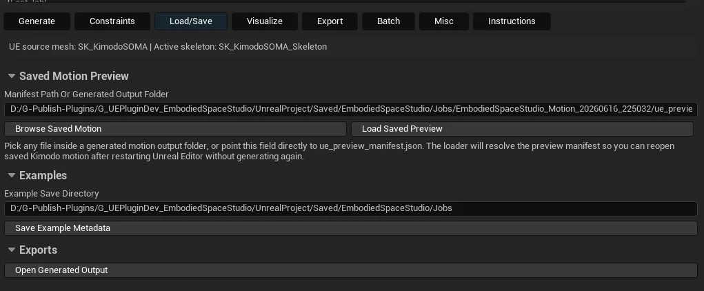

### Saved Motion Preview

1. **Manifest Path Or Generated Output Folder** can point directly to `ue_preview_manifest.json`, to the generated output folder that contains it, or to any file inside that output folder.
2. **Browse Saved Motion** opens a file picker and stores the selected path in the field.
3. **Load Saved Preview** resolves the manifest path, parses the preview data, restores motion samples, reloads prompt timeline metadata when available, and updates the active Preview/Level Target.
4. Use this when reopening previous jobs after restarting Unreal Editor or when reviewing batch-generated outputs.

### Examples

1. **Example Save Directory** sets where reusable example metadata is written.
2. **Save Example Metadata** captures current prompt segments, constraints, source character context, constraints path, and related preview metadata so a setup can be loaded again as an example.

### Exports

1. **Open Generated Output** opens the latest generated output folder reported by the bridge, where `motion.npz`, `ue_preview_manifest.json`, constraints files, prompt metadata, and diagnostics live.

### Recommended Workflow

Load saved preview manifests for review, save example metadata for prompt/constraint templates, and open the generated output folder when validating files before export or batch packaging.

  </TabItem>
  <TabItem value="visualize" label="Visualize">

### Purpose

Adjust playback, visual overlays, camera display, and Timeline/interface visibility. These settings help inspect motion and constraints without changing the generated motion data.

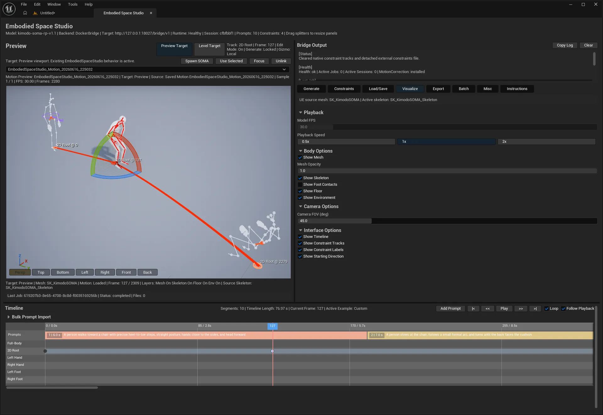

### Playback

1. **Model FPS** displays the active clip's FPS when a preview is loaded, otherwise the configured default. It is read-only in the current UI.
2. **Playback Speed** switches preview playback between 0.5x, 1x, and 2x.
3. The Timeline playback buttons, sample selector, Loop, and Follow Playback use this playback state.

### Body Options

1. **Show Mesh** toggles the skinned preview mesh. **Mesh Opacity** makes the mesh transparent for checking skeleton, constraints, and floor contact.
2. **Show Skeleton** displays the skeleton overlay. **Show Foot Contacts** is enabled only when skeleton display is active and shows contact markers/foot-contact state from the loaded clip.
3. **Show Floor** and **Show Environment** control the embedded preview scene floor and environment. In Level Target mode, related display options are synced to the Level Target actor when possible.

### Camera Options

1. **Camera FOV** adjusts the embedded preview camera field of view. The Preview viewport view buttons still choose perspective or orthographic directions.

### Interface Options

1. **Show Timeline** shows or hides the bottom Timeline.
2. **Show Constraint Tracks** toggles constraint rows in the Timeline. **Show Constraint Labels** toggles labels for constraint markers.
3. **Show Starting Direction** displays the starting direction reference for previewed motion.
4. **Dark Mode** toggles dark presentation styling where the UI supports it.

### Recommended Workflow

After generation, inspect the mesh first, then enable skeleton and foot contacts for debugging, lower opacity when checking intersections, and use floor/environment/FOV settings to judge grounding and readability.

  </TabItem>
  <TabItem value="export" label="Export">

### Purpose

Convert the active Kimodo preview clip into Unreal assets. Export can bake a SOMA Animation Sequence directly, or retarget the motion through IK Rig / IK Retargeter assets to Manny, Quinn, MetaHuman, or a custom target character.

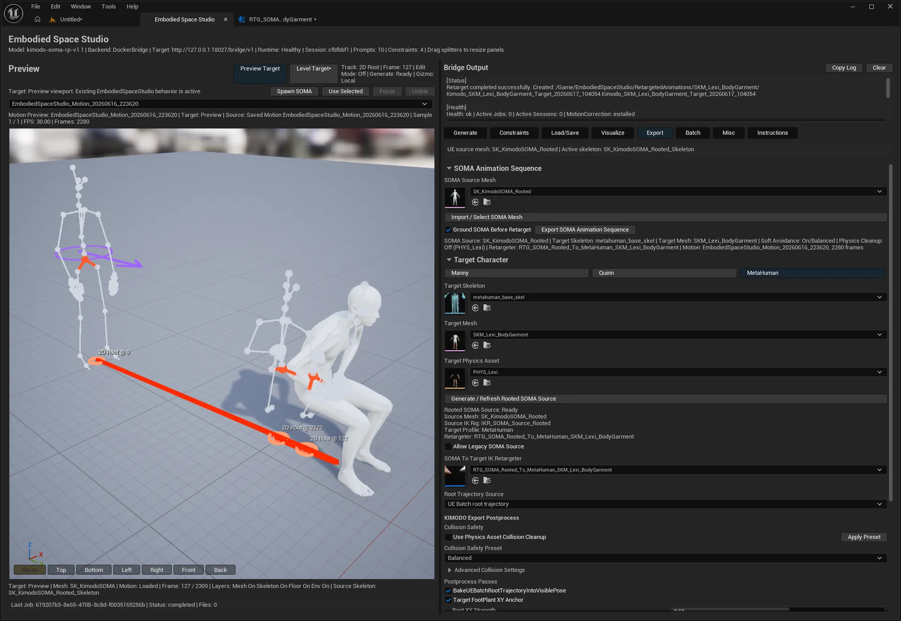

### SOMA Animation Sequence

1. **SOMA Source Mesh** selects the mesh used when baking the Kimodo/SOMA source animation.
2. **Import / Select SOMA Mesh** imports or selects the bundled/default SOMA source mesh asset.
3. **Ground SOMA Before Retarget** grounds the SOMA source animation before it is used as retarget source data.
4. **Export SOMA Animation Sequence** writes the active preview clip to a UE AnimSequence for the selected SOMA source mesh.
5. The retargeting summary reports active source/target readiness and why export buttons may be disabled.

### Target Character

1. **Manny**, **Quinn**, and **MetaHuman** preset buttons switch the active target profile and restore profile-specific mesh, skeleton, physics, retargeter, and runtime postprocess settings where saved.
2. **Target Skeleton**, **Target Mesh**, and **Target Physics Asset** choose the destination skeleton/mesh/collision assets. Compatible meshes or physics assets may be auto-filled from the selected skeleton or mesh.
3. **Generate / Refresh Rooted SOMA Source** selects/imports `SK_KimodoSOMA_Rooted`, refreshes the SOMA source IKRig, and rebuilds rooted SOMA retarget assets for the current target.
4. **Allow Legacy SOMA Source** exists for legacy fallback/debugging. Normal production export should use the rooted SOMA source.
5. **SOMA To Target IK Retargeter** selects the authored/generated RTG used by Export Target Animation Sequence.
6. **Root Trajectory Source** chooses whether target export follows UE Batch root trajectory or KIMODO/SOMA smooth root trajectory where supported. Rooted SOMA rejects unsupported KIMODO smooth-root fallback and prefers UE Batch validation.

### KIMODO Export Postprocess

1. **Use Physics Asset Collision Cleanup** enables target Physics Asset based clearance cleanup. **Apply Preset** recommends collision safety settings for the selected target.
2. **Collision Safety Preset** chooses a saved preset. **Advanced Collision Settings** expose Clearance Margin, Max Limb Correction, and Solver Iterations.
3. **Postprocess Passes** include visible controls such as **Run IK Rig During Retarget** and **Auto Fix Foot Tilt** when present in the current build.
4. **Target FootPlant XY Anchor** controls root/IK foot anchor strength, Max IK correction, Smooth frames, Contact Threshold, and Release Threshold. It only takes effect when contact data exists.
5. Additional grounding and diagnostic passes, including final visual-sole grounding and per-animation final grounding, are written into export diagnostics and applied according to the current build/runtime configuration even when their debug toggles are hidden.

### Retarget Assets

1. **Retarget Assets Name** overrides the generated IKRig/RTG asset base name; leaving it blank uses an automatic name based on the target mesh and timestamp.
2. **Export Retarget Assets** creates or refreshes source/target IK Rig and IK Retargeter assets for the current source/target pair. **Auto Search SourceScaleFactor** runs a full-frame pose optimization when enabled.

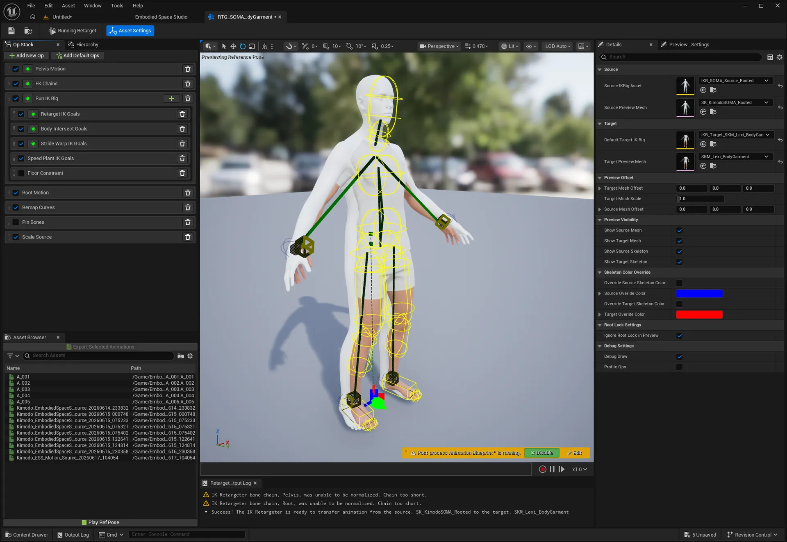
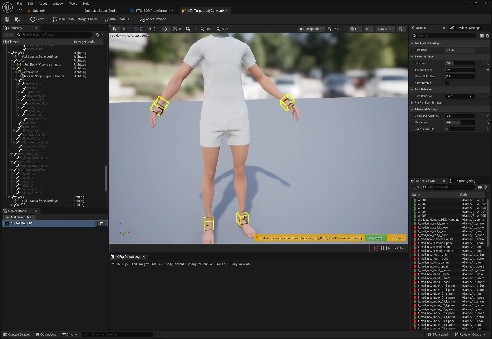
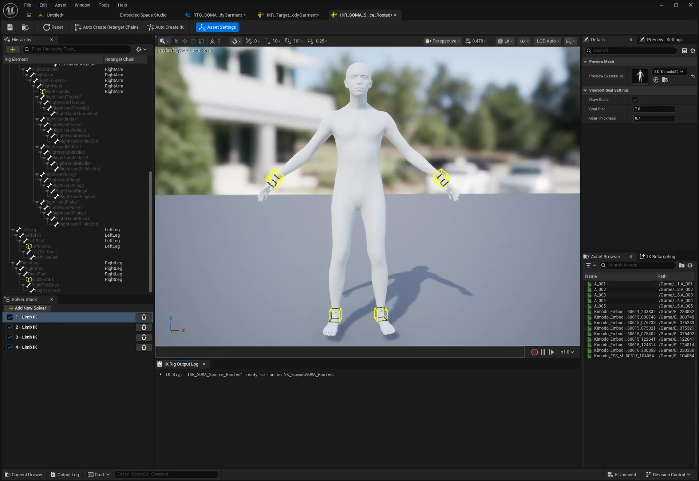


3. **Auto Scale Loss Weights** tune the optimization balance for General Pose, Special Pose, Foot Sliding, and Scale Prior. **Reset Auto Scale Weights** restores defaults.
4. **Refresh RTG From Authored IK Rig** rebinds and saves the selected retargeter while preserving authored chains, goals, solvers, poses, and retarget ops.
5. **Export Target Animation Sequence** runs the selected RTG on the active SOMA preview clip, applies export postprocess/diagnostics, saves the target AnimSequence, and copies reports next to the output package.

### Recommended Workflow

Generate or load the motion, export/refresh rooted SOMA source, choose target preset/assets, export or verify the RTG, check collision and foot-anchor settings, then run Export Target Animation Sequence.

  </TabItem>
  <TabItem value="batch" label="Batch">

### Purpose

Run production-scale generation and export. Batch can generate from a Markdown prompt file, or skip generation and export from an existing folder of completed SOMA jobs.

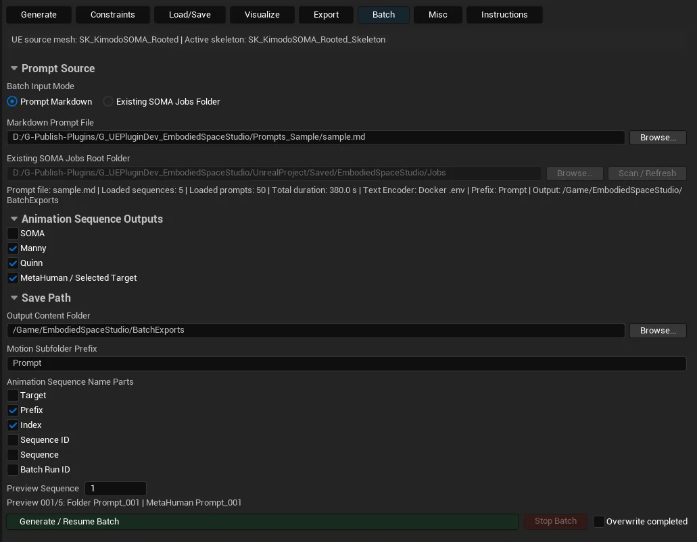

### Prompt Source

1. **Prompt Markdown** mode reads a Markdown prompt file, builds prompt sequences, submits each sequence to Generate, and exports selected target animations after each job completes.
2. **Existing SOMA Jobs Folder** mode reads already-generated job folders and runs export/retarget only.
3. **Markdown Prompt File** chooses the batch prompt source. **Existing SOMA Jobs Root Folder** chooses the root folder to scan.
4. **Browse...** opens file/folder pickers. **Scan / Refresh** parses existing job folders and their `ue_preview_manifest.json` files.
5. The batch summary reports loaded sequence/job counts and any parsing or scan status.

### Animation Sequence Outputs

1. **SOMA** exports the source SOMA AnimSequence.
2. **Manny** and **Quinn** export the matching UE Mannequin targets using their configured presets.
3. **MetaHuman / Selected Target** exports through the current MetaHuman or manually configured target settings from Export.
4. Batch reuses the current Export tab target, rooted SOMA, collision, RTG, postprocess, and Ground SOMA Before Retarget state.

### Save Path

1. **Output Content Folder** must be a valid `/Game` package path and becomes the root for exported batch assets.
2. **Motion Subfolder Prefix** controls per-motion folder names.
3. **Animation Sequence Name Parts** controls whether generated target animation names include Target, Prefix, Index, Sequence ID, Sequence, and Batch Run ID.
4. **Preview Sequence** lets you inspect a representative folder and animation name for a chosen sequence number before running the batch.

### Execution

1. **Generate / Resume Batch** starts a new run or resumes a run from the tracked current sequence.
2. **Stop Batch** requests a safe stop after the active request/export reaches an interruption point.
3. **Overwrite completed** allows already-completed exports to be replaced instead of skipped.
4. Batch tracks prompt retries, handled job IDs, existing motion export counts, skipped motions, and active job state internally.

### Recommended Workflow

Validate one Generate + Export manually, then use Batch with a clean output folder. Preview names before committing, leave Overwrite completed off for resumable production, and use Existing SOMA Jobs Folder when only retarget/export needs to be repeated.

  </TabItem>
  <TabItem value="misc" label="Misc">

### Purpose

Production utilities that do not fit a single Generate/Export run: level placement, playable MetaHuman setup, merged MetaHuman meshes, Fab package assembly, offline animation cleanup, MetaHuman Level Sequences, and prompt subtitle overlays.

### Batch Level Layout

**Overview:** Places exported batch animations into the current level as preview actors with readable labels, so a full motion pack can be reviewed spatially.

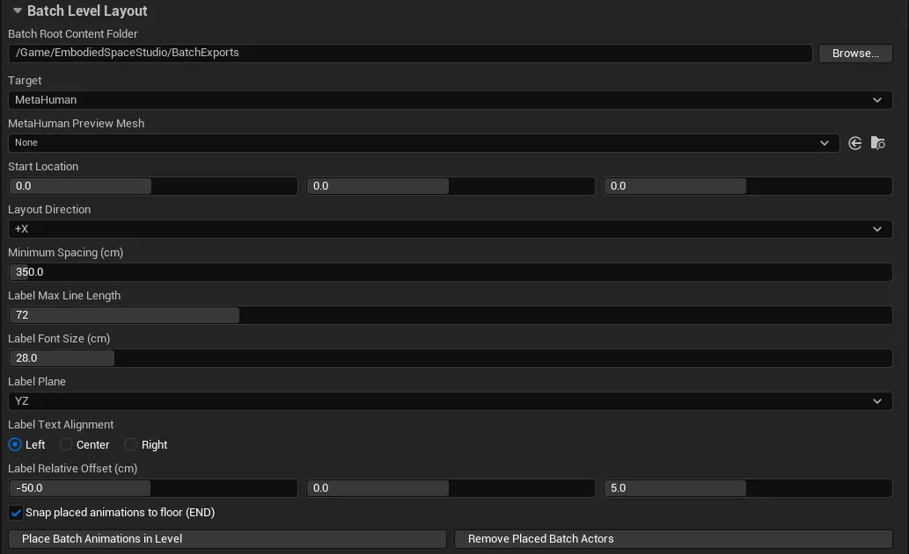

1. **Batch Root Content Folder** selects the batch export root under `/Game`, and **Target** chooses the exported target family to place.
2. **MetaHuman Preview Mesh** is shown only for the MetaHuman target and overrides the preview mesh used for placed MetaHuman animations.
3. **Start Location**, **Layout Direction**, and **Minimum Spacing (cm)** define the placement line in the current level.
4. **Label Max Line Length**, **Label Font Size (cm)**, **Label Plane**, **Label Text Alignment**, and **Label Relative Offset (cm)** control the text actors placed with each animation.
5. **Snap placed animations to floor (END)** grounds placed actors by their ending pose. **Place Batch Animations in Level** creates the actors/labels, and **Remove Placed Batch Actors** clears the tool-created actors from the current level.

### MetaHuman Player Character

**Overview:** Creates or updates a playable character Blueprint that drives a selected MetaHuman through a project pawn class.

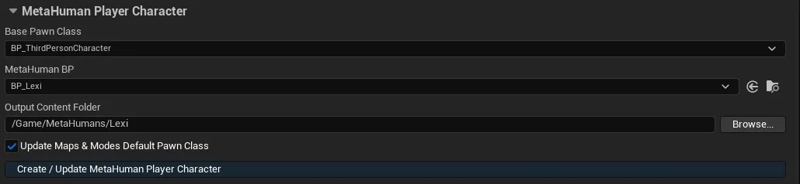

1. **Base Pawn Class** chooses the pawn/character class to duplicate or create from.
2. **MetaHuman BP** selects the MetaHuman actor blueprint to bind into a playable character.
3. **Output Content Folder** chooses where the generated character blueprint is saved.
4. **Update Maps & Modes Default Pawn Class** updates the project Maps & Modes default pawn to the generated character when enabled.
5. **Create / Update MetaHuman Player Character** builds or updates the playable blueprint and saves the asset.

### MetaHuman Body + Garment Mesh

**Overview:** Builds a single body-plus-garment Skeletal Mesh for MetaHuman animation preview/export workflows while leaving the face/head assets separate.

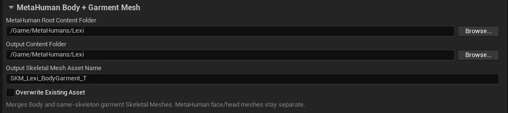

1. **MetaHuman Root Content Folder** points to the MetaHuman asset folder to scan.
2. **Output Content Folder** and **Output Skeletal Mesh Asset Name** define where the merged body + garment Skeletal Mesh is saved.
3. **Overwrite Existing Asset** allows replacing the generated mesh. The tool merges the Body mesh and same-skeleton garment meshes; MetaHuman face/head meshes stay separate.
4. **Create Body + Garment Skeletal Mesh** performs the merge and saves the output asset.

### Fab Product Package

**Overview:** Assembles exported animations, demo assets, supporting files, and motion indexes into a clean product content root for Fab delivery/review.

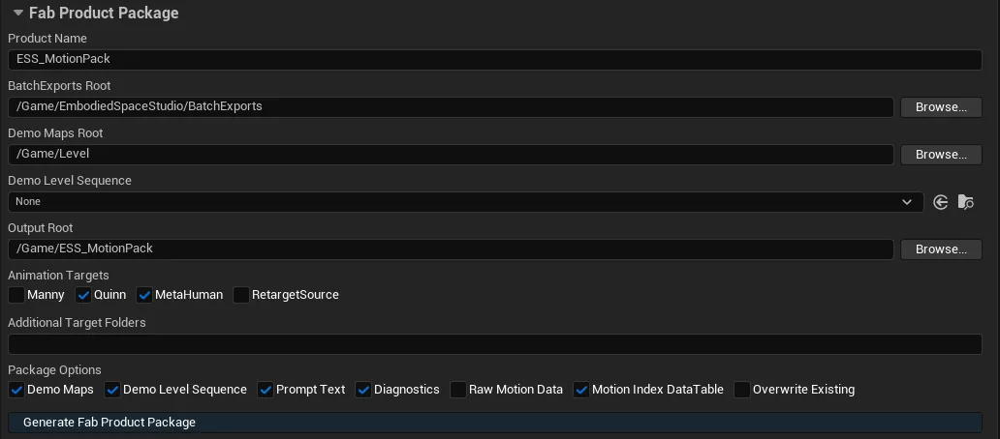

1. **Product Name**, **BatchExports Root**, **Demo Maps Root**, **Demo Level Sequence**, and **Output Root** define the package source content and destination root.
2. **Animation Targets** include Manny, Quinn, MetaHuman, RetargetSource, plus **Additional Target Folders** for extra target folders entered manually.
3. **Package Options** include Demo Maps, Demo Level Sequence, Prompt Text, Diagnostics, Raw Motion Data, Motion Index DataTable, and Overwrite Existing.
4. **Generate Fab Product Package** copies selected assets and dependencies, builds package docs/reports, and optionally creates the UE DataTable plus CSV/JSON motion indexes.

### Soft Collision Avoidance

**Overview:** Applies an offline physics-asset collision clearance pass to target AnimSequences to reduce body/limb intersections after export.

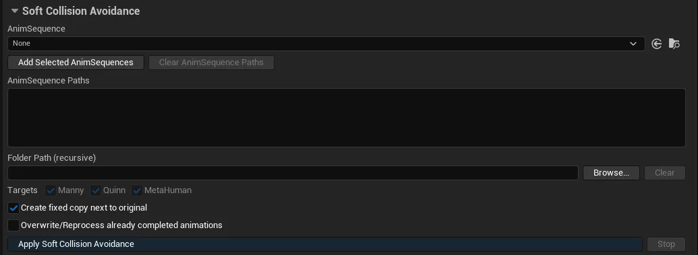

1. **AnimSequence** selects one animation. **Add Selected AnimSequences** fills the multi-path list from Content Browser selections, and **Clear AnimSequence Paths** clears that list.
2. **AnimSequence Paths** accepts pasted animation asset paths. **Folder Path (recursive)** switches to folder mode, where the single AnimSequence and pasted paths are ignored until **Clear** exits folder mode.
3. In folder mode, **Targets** filters recursive processing to Manny, Quinn, and/or MetaHuman outputs.
4. **Create fixed copy next to original** duplicates before processing. **Overwrite/Reprocess already completed animations** allows repeated processing. **Apply Soft Collision Avoidance** starts the operation, and **Stop** requests cancellation while the batch is active.

### Self Collision Pose Fix

**Overview:** Re-solves target poses to push self-intersecting body parts apart, optionally using the matching SOMA source motion as a guide.

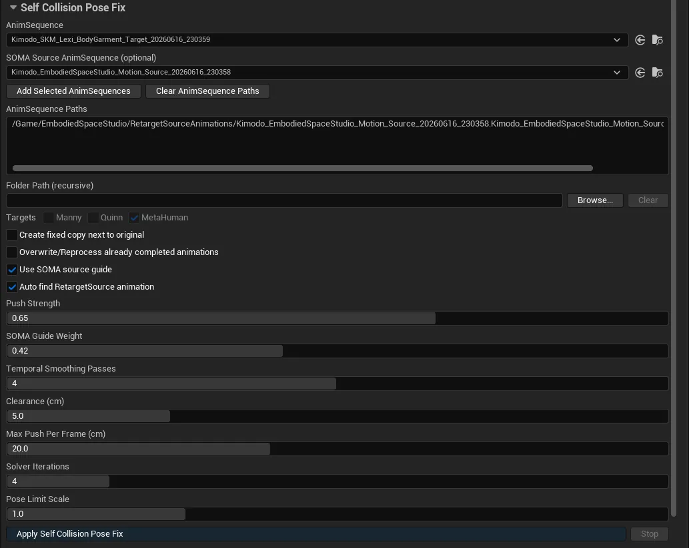

1. **AnimSequence**, **Add Selected AnimSequences**, **AnimSequence Paths**, and **Folder Path (recursive)** use the same single/list/folder source workflow as Soft Collision Avoidance.
2. **SOMA Source AnimSequence (optional)** can guide the fix outside folder mode. **Use SOMA source guide** enables guide influence, and **Auto find RetargetSource animation** resolves matching RetargetSource assets automatically; folder mode always uses per-animation auto search when the guide is enabled.
3. Folder-mode **Targets** filter Manny, Quinn, and/or MetaHuman outputs. **Create fixed copy next to original** and **Overwrite/Reprocess already completed animations** control output replacement.
4. **Push Strength**, **SOMA Guide Weight**, **Temporal Smoothing Passes**, **Clearance (cm)**, **Max Push Per Frame (cm)**, **Solver Iterations**, and **Pose Limit Scale** tune the pose solver.
5. **Apply Self Collision Pose Fix** starts the operation, and **Stop** requests cancellation while the batch is active.

### Target Foot Sole Grounding

**Overview:** Measures target foot sole height and applies vertical correction so exported animations stand on the desired ground plane.

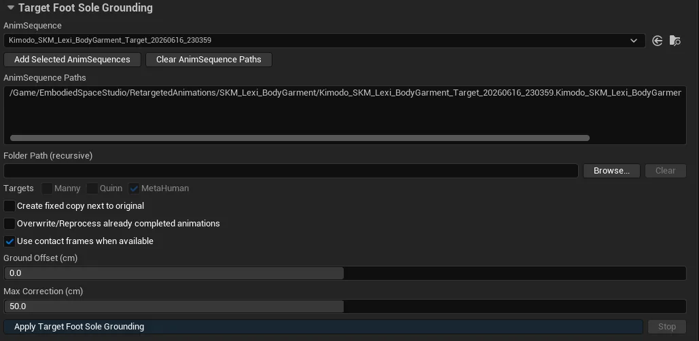

1. **AnimSequence**, **Add Selected AnimSequences**, **AnimSequence Paths**, and **Folder Path (recursive)** use the same single/list/folder source workflow as the other offline cleanup tools.
2. Folder-mode **Targets** filter Manny, Quinn, and/or MetaHuman outputs. **Create fixed copy next to original** and **Overwrite/Reprocess already completed animations** control output replacement.
3. **Use contact frames when available** prefers detected contact frames for measuring sole height. **Ground Offset (cm)** sets the desired sole height, and **Max Correction (cm)** clamps the applied vertical correction.
4. **Apply Target Foot Sole Grounding** starts the operation, and **Stop** requests cancellation while the batch is active.

### MetaHuman Level Sequence

**Overview:** Creates a MetaHuman Level Sequence from exported MetaHuman AnimSequences, with optional clip alignment and transition gap controls.

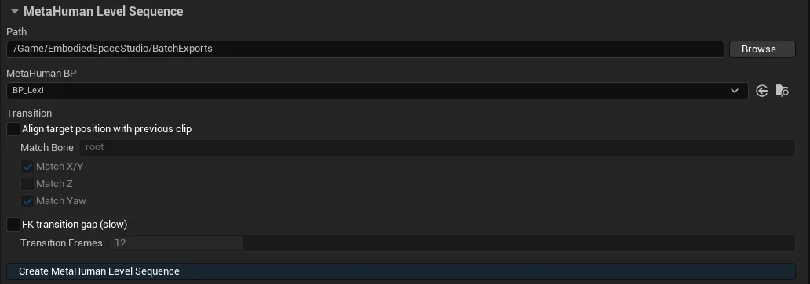

1. **Path** scans for MetaHuman AnimSequence assets under the selected `/Game` folder.
2. **MetaHuman BP** selects the actor blueprint to spawn/bind in the generated Level Sequence.
3. **Transition** controls include **Align target position with previous clip**, **Match Bone**, **Match X/Y**, **Match Z**, and **Match Yaw** for continuity between clips.
4. **FK transition gap (slow)** optionally bakes through the built-in FK Control Rig, and **Transition Frames** sets the inserted gap length when that option is enabled.
5. **Create MetaHuman Level Sequence** creates a new Level Sequence asset, spawns the MetaHuman, adds body animation sections, and places a Level Sequence actor.

### Level Sequence Prompt Subtitles

**Overview:** Adds prompt-derived 3D subtitle actors to a Level Sequence so generated motions can be reviewed with their source prompt text in context.

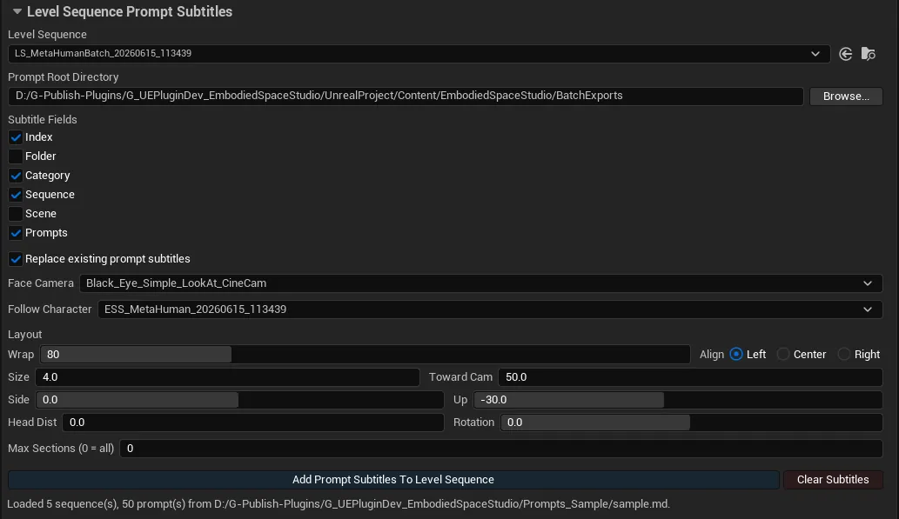

1. **Level Sequence** chooses the sequence to annotate. **Prompt Root Directory** chooses where the prompt Markdown/data is resolved from and can be a `/Game` path or filesystem folder.
2. **Subtitle Fields** toggles Index, Folder, Category, Sequence, Scene, and Prompts. **Replace existing prompt subtitles** removes previous tool-created subtitles before regenerating.
3. **Face Camera** and **Follow Character** can auto-resolve from sequence bindings or target a specific camera/character binding.
4. **Layout** controls Wrap, Align (Left/Center/Right), Size, Toward Cam, Side, Up, Head Dist, Rotation, and Max Sections (0 = all). Max Sections is useful for quick preview passes before generating all subtitles.
5. **Add Prompt Subtitles To Level Sequence** creates subtitle actors/bindings. **Clear Subtitles** removes subtitles created by this tool.

:::note
The older SOMA Scale to MetaHuman UI is archived/hidden in the current Misc tab, so it is not listed as an active user-facing tool here.
:::

### Recommended Workflow

Place batch animations after exports are stable, run offline cleanup on fixed copies first, generate Fab packages into a clean output root, and use subtitle Max Sections for quick preview before annotating a full Level Sequence.

  </TabItem>
</Tabs>
