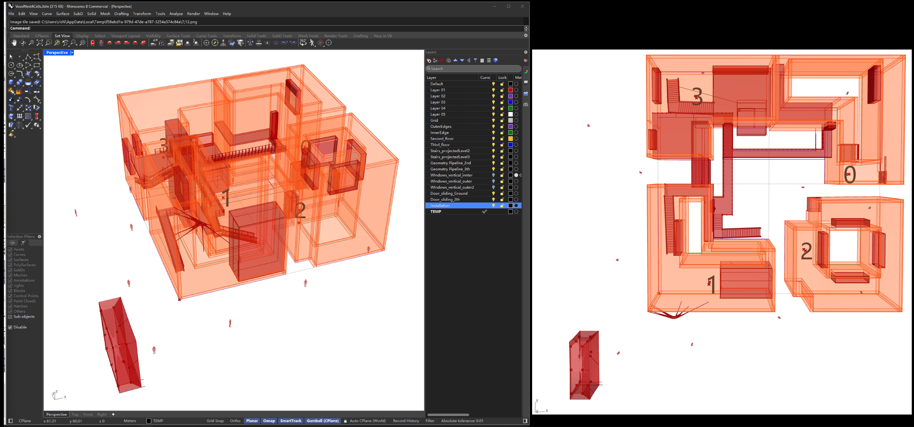
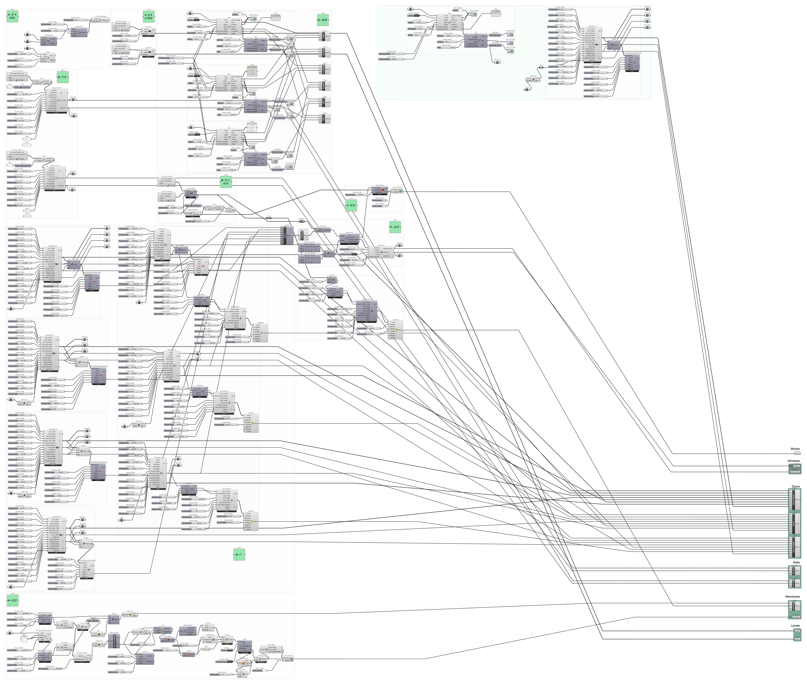
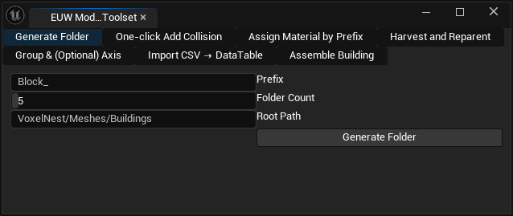
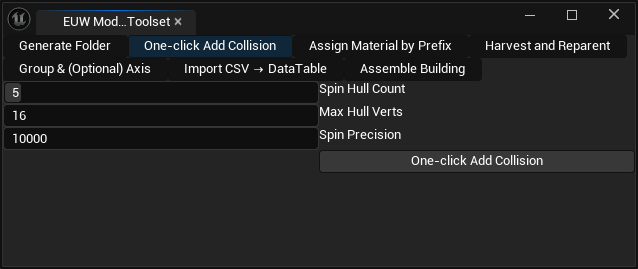
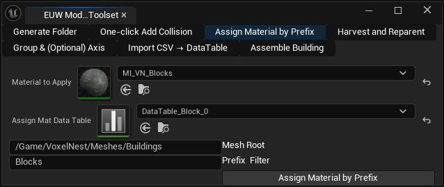
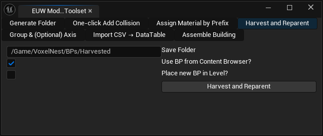
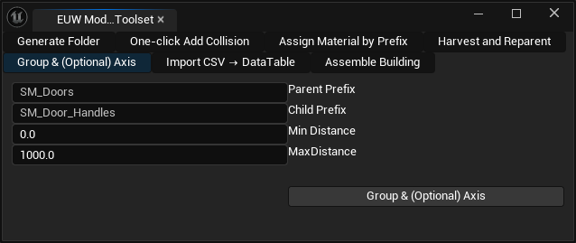
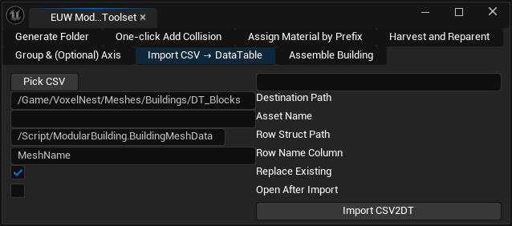
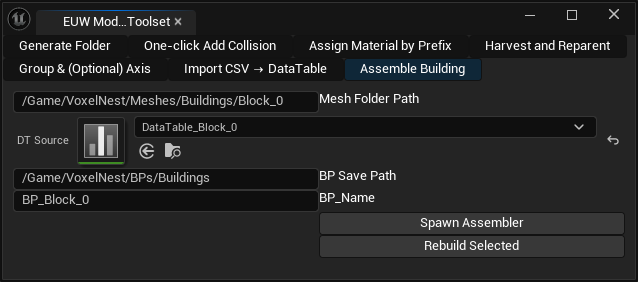

import Link from '@docusaurus/Link';

# Modular Building [UE Plugin]

## 1. Design architecture parametrically using Rhino3D and Grasshopper

:::tip

You may use any 3D modeling software, such as Blender, as long as the final exported model includes an .fbx 3D model file and a corresponding data file containing the bounding box vertex data for each geometric object (see below). This will allow for automatic assembly in UE.

:::

<a class="button button--primary" href="/coding-x/downloads/VoxelNest_RHGH3DModel.7z" download>
  Download Parametric Design Models and Code (Rhino3D + Grasshopper)
</a>

<a class="button button--primary" href="/coding-x/downloads/VoxelNest_RH4UE.7z" download>
  Download Rhino3D Custom Plugin RH4UE (used for exporting model data)
</a>

<a class="button button--primary" href="/coding-x/downloads/VoxelNest_ExportedGeosNdata.7z" download>
  Download the exported .fbx files and .csv datasets
</a>

**Download the parametric design (Grasshopper) plugin Moths from [food4rhino](https://www.food4rhino.com/en/app/moths)**

### A-Node-based programming (Graph) in Grasshopper

The graph code can be obtained directly from the downloaded file. If you are using another 3D modeling software for your design, you may ignore this part and refer directly to the exported .fbx model and the corresponding .csv data file format.

### B-Use the developed RH4UE plugin (Rhino3D) to assist in exporting the data file of the 3D model

:::tip
Obtain the RH4UE plugin from the downloaded file mentioned above.
:::

**This is the plugin of the developed RH For UE Toolset, which includes two main functions: object renaming and CSV export of positioning data.**

**Renaming Function:**

The program iterates through the objects currently selected by the user in Rhino and automatically assigns each a unique new name based on its layer. The naming rules can be configured to either "start numbering from 0" or "continue from the maximum number already used on that layer." By parsing existing names using regular expressions and maintaining a set of used numbers and the current maximum, the program ensures no duplicates are generated. This enables standardized and conflict-free batch naming within each layer.

**CSV Export Function:**

The program reads the selected objects’ attribute names (or uses their IDs as a fallback), calculates their axis-aligned bounding boxes (AABB) in the world coordinate system, and retrieves the coordinates of all eight corner points. It then writes each object’s data to the CSV file line by line, including the identifier and the 3D coordinates of each vertex. Standard CSV escaping rules are applied, ensuring compatibility with downstream data analysis or external spatial positioning workflows.

The exported .fbx 3D model and the corresponding .csv format data. You can export the .fbx model and the corresponding .csv geometric data either by unit or based on any set of geometric objects intended for assembly.

| RowName            | MeshName           |   Corner0_X |   Corner0_Y |   Corner0_Z |   Corner1_X |   Corner1_Y |   Corner1_Z |   Corner2_X |   Corner2_Y |   Corner2_Z |   Corner3_X |   Corner3_Y |   Corner3_Z |   Corner4_X |   Corner4_Y |   Corner4_Z |   Corner5_X |   Corner5_Y |   Corner5_Z |   Corner6_X |   Corner6_Y |   Corner6_Z |   Corner7_X |   Corner7_Y |   Corner7_Z |
|:-------------------|:-------------------|------------:|------------:|------------:|------------:|------------:|------------:|------------:|------------:|------------:|------------:|------------:|------------:|------------:|------------:|------------:|------------:|------------:|------------:|------------:|------------:|------------:|------------:|------------:|------------:|
| apparatus_0        | apparatus_0        |      95.988 |     2358.8  |    1115.54  |    1216.34  |     2358.8  |    1115.54  |    1216.34  |     2533.79 |    1115.54  |      95.988 |     2533.79 |    1115.54  |      95.988 |     2358.8  |    1908.01  |    1216.34  |     2358.8  |    1908.01  |    1216.34  |     2533.79 |    1908.01  |      95.988 |     2533.79 |    1908.01  |
| stairs_glasses_4   | stairs_glasses_4   |     312.729 |     3274.07 |       0     |     312.729 |     3274.07 |       0     |     312.729 |     4310.98 |       0     |     312.729 |     4310.98 |       0     |     312.729 |     3274.07 |     590     |     312.729 |     3274.07 |     590     |     312.729 |     4310.98 |     590     |     312.729 |     4310.98 |     590     |
| stairs_glasses_7   | stairs_glasses_7   |     162.729 |     3274.07 |       0     |     162.729 |     3274.07 |       0     |     162.729 |     4310.98 |       0     |     162.729 |     4310.98 |       0     |     162.729 |     3274.07 |     590     |     162.729 |     3274.07 |     590     |     162.729 |     4310.98 |     590     |     162.729 |     4310.98 |     590     |
| stairs_railings_18 | stairs_railings_18 |     307.729 |     4310.98 |     590     |     317.729 |     4310.98 |     590     |     317.729 |     4328.99 |     590     |     307.729 |     4328.99 |     590     |     307.729 |     4310.98 |     608.687 |     317.729 |     4310.98 |     608.687 |     317.729 |     4328.99 |     608.687 |     307.729 |     4328.99 |     608.687 |
| stairs_railings_21 | stairs_railings_21 |     307.729 |     3274.07 |      90     |     317.729 |     3274.07 |      90     |     317.729 |     4315.48 |      90     |     307.729 |     4315.48 |      90     |     307.729 |     3274.07 |     602.172 |     317.729 |     3274.07 |     602.172 |     317.729 |     4315.48 |     602.172 |     307.729 |     4315.48 |     602.172 |

## 2. Import and assemble the building using the Modular Building plugin in Unreal Engine – User Manual

The **Modular Building Plugin** provides a suite of productivity tools inside Unreal Engine Editor Utility Widgets (EUWs) to speed up the handling of modular assets, from folder management to building assembly.

This manual explains the workflow and details each of the seven functional modules, helping designers and technical artists streamline asset preparation, data integration, and automated assembly.

---

### 1. Generate Folder

**Purpose:**
Quickly create standardized folder structures in your project’s Content Browser for organizing modular building assets.

**How to Use:**

* Launch the EUW for the plugin.
* Click **Generate Folder**.
* A dialog will appear (powered by `open_directory_dialog.py`) for you to choose a base path.
* The system will auto-generate subfolders (e.g., *Meshes*, *Materials*, *Blueprints*, *DataTables*) for consistent asset organization.

**Benefit:**
Ensures all team members follow a unified directory structure, reducing confusion and manual setup time.

---

### 2. One-click Add Collision

**Purpose:**
Automatically generate convex collision meshes for selected Static Mesh assets.

**How to Use:**

* In the Content Browser, select one or multiple Static Mesh assets.
* Click **One-click Add Collision** in the EUW.
* The script (`generate_kinetic_convex_collision.py`) runs `EditorStaticMeshLibrary.generate_kinetic_convex_collision`.
* The selected meshes are updated with convex collision and marked dirty for saving.

**Benefit:**
Eliminates repetitive manual collision setup and ensures assets are game-ready with one click.

---

### 3. Assign Material by Prefix

**Purpose:**
Assign materials to static meshes based on naming prefixes or DataTable whitelist.

**How to Use:**

* Select a root folder, a set of Static Meshes, or a DataTable containing mesh names.
* Provide:

  * **Prefix Filter** (e.g., `Blocks, Windows*`)
  * **Material Asset Path**
* Run **Assign Material by Prefix**.
* The script (`assign_material_by_prefix.py`) matches meshes against the prefix or DataTable and assigns the chosen material.

**Benefit:**
Ensures consistent material assignment for large asset sets, following naming conventions or structured data.

---

### 4. Harvest and Reparent

**Purpose:**
Extract and reorganize components from existing Blueprints while preserving hierarchy and reparenting relationships.

**How to Use:**

* Select Blueprint assets in the Content Browser **or** Blueprint actors in the Level.
* Click **Harvest and Reparent**.
* The system (`harvest_blueprint.py`) will:

  * Safely duplicate components without name collisions.
  * Copy transform, materials, and key properties.
  * Reattach components to maintain hierarchy.
  * Save a new “_harvest” Blueprint to the specified folder.

**Benefit:**
Creates clean, reusable modular Blueprints from existing assets or actors, preserving structure and avoiding duplicated names.

---

### 5. Group & (Optional) Axis

**Purpose:**
Group meshes by distance or other rules and optionally create virtual axis helpers for alignment.

**How to Use:**

* In the Level Editor, select actors or meshes.
* Activate **Group & Axis**.
* The system groups meshes and creates SceneComponent-based axes (when enabled) as parents.

**Benefit:**
Simplifies modular hierarchy setup (e.g., doors → door handles), keeps pivots aligned, and allows optional axis parenting for animation or control.

---

### 6. Import CSV → DataTable

**Purpose:**
Convert CSV files into Unreal DataTables based on a row struct definition.

**How to Use:**

* Prepare a CSV file (columns must match `FBuildingMeshData` from `BuildingMeshData.h`, e.g., `MeshName`, `Corner0_X`, …).
* In the EUW, choose **Import CSV → DataTable**.
* Provide:

  * CSV path
  * Destination folder (must start with `/Game/...`)
  * Row Struct (usually `FBuildingMeshData`)
* Script (`import_csv_to_datatable.py`) will create or overwrite a DataTable.

**Benefit:**
Bridges external design data (e.g., Rhino/Grasshopper exported CSVs) into Unreal Engine for direct use in modular assembly workflows.

---

### 7. Assemble Building

**Purpose:**
Automatically assemble building blocks into a complete modular building inside Unreal Engine using data-driven workflows.

**How to Use:**

* Prepare a DataTable (from step 6) with mesh names and placement data.
* In EUW, select **Assemble Building**.
* The system spawns actors or Blueprints according to DataTable entries and groups them under a master building actor.

**Benefit:**
Reduces manual drag-and-drop work, enables repeatable parametric-like building assembly directly in Unreal Engine.

---

The Modular Building Plugin integrates asset management, collision setup, material assignment, Blueprint harvesting, grouping, data import, and automated assembly into a single workflow.

By leveraging these seven tools, teams can drastically reduce manual repetitive tasks, ensure consistency across assets, and enable data-driven design-to-engine pipelines.

This plugin is particularly suited for workflows involving **parametric modeling, digital construction, and AR/VR simulation**, making Unreal Engine a hub for both design iteration and final deployment.

---

:::info
Using the Modular Building plugin, a complex architectural structure consisting of 25 units was imported and assembled.
:::

